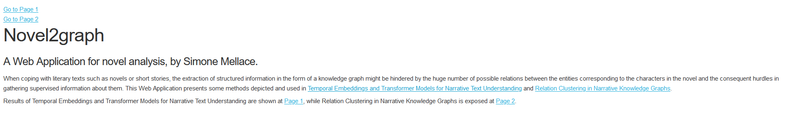
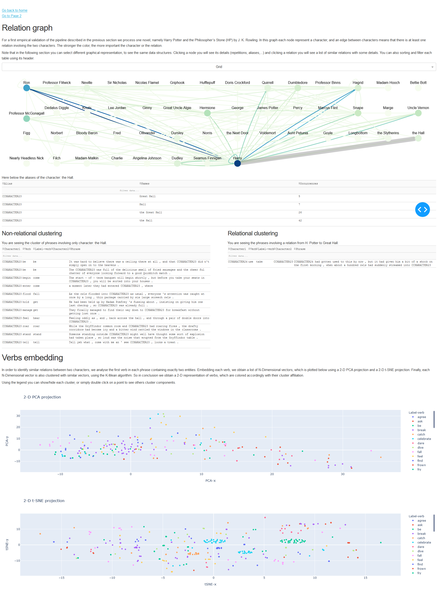
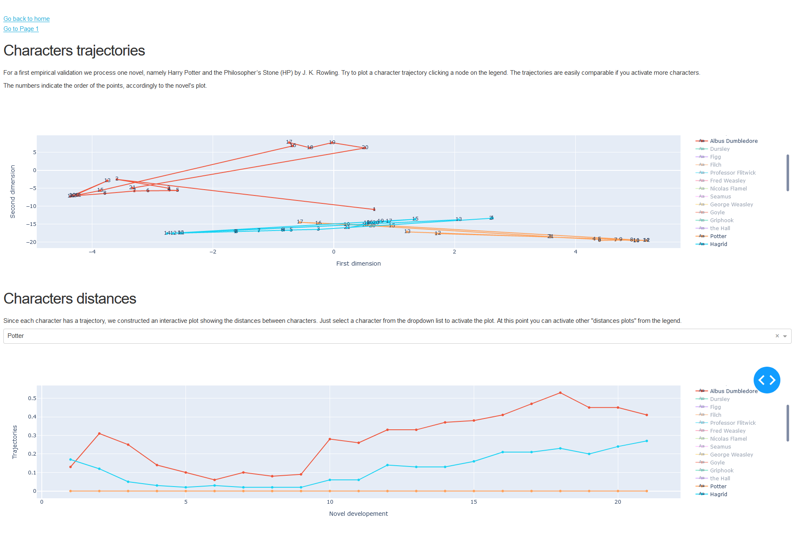

# NOVEL2GRAPH
## A workflow to extract Knowledge Graph from literary text
### By [Mellace Simone](https://github.com/mellacsi), [Kanjirangat Vani](https://github.com/vanikanjirangat) and [Antonucci Alessandro](https://github.com/alessandroantonucci)
This pipeline is a semi-supervised algorithm, which receives a book as input and it discovers: the main characters, the main relations between characters, a Knowledge Graph including these information and more interesting material.
As final result, you will obtain an interface with which you can monitor and explore your results.

>

>

>

This work is based on [Temporal Embeddings and Transformer Models for Narrative Text Understanding](https://arxiv.org/abs/2003.08811), [Relation Clustering in Narrative Knowledge Graphs](https://arxiv.org/abs/2011.13647) and [NOVEL2GRAPH: Visual Summariesof Narrative Text Enhanced by Machine Learning](http://ceur-ws.org/Vol-2342/paper4.pdf).


## Quickstart
- Clone the project
- Download the latest version of https://nlp.stanford.edu/software/CRF-NER.shtml#Download
- Unzip the downloaded folder `stanford-ner-20XX-XX-XX` and put it in `./libraries`
- The same as before following https://stanfordnlp.github.io/CoreNLP#Quickstart
- Install requirements.txt
- Start test_static_dynamic_embedding.py and test_relations_clustering.py providing a book in txt format
- [Optional] Run test_relations_classifier.py or test_Bert_family_cls.py to discover more information about the book
- Run GUI/test_dash.py to start the interface on your machine


### Start
First perform the static and dynamic embedding of your book by typing:
```shell
$ python Code/test_static_dynamic_embedding.py myBook.txt
```
Secondly generate the Knowledge Graph of your book by typing:
```shell
$ python Code/test_relations_clustering.py myBook.txt
```
Finally run the interface to analyze and interact with your results:
```shell
$ python Code/GUI/test_dash.py myBook.txt
```

### Output 
Results are generated in *Data* folder, in particular this folder could contain these others sub-folders:
- *clust&Dealias/bookName/*: which for each book you run the algorithm with, contains the following files:
    - *bookName_occurrences.csv* contains a list of character names and occurrences;
    - *bookName_more_than_1.csv* as before but only with names occurring more than once;
    - *bookName_clusters.csv* contains all clusters (each row shows a cluster id, the contained names and the occurrences);
    - *bookName_out.txt* contains the coreferenced story in which originals names are replaced with an identifier ("CHARACTERX")
    - *\*.pkl* are cached data.
- *embedding*:
    - *embeddings* cache data containing the embedding of the book;
    - *models/bookName/chapters* contains dynamic and static models trained on the slices;
    - *slices/bookName/chapters* contains slices (text divided in chapters) which are use to train each model.
- *embedRelations/book/*:
    - *bookName_report_X.txt* contains all relations involving X characters;
    - *bookName_embeddings_X.pkl* contains embedded relations data;
    - *bookName_zero_char_sentences.pkl* contains sentences with 0 characters;
    - *bookName_few_char_sentences.pkl* contains sentences with fewer characters than desired (you can specify the desired amount in the code);
    - *bookName_right_char_sentences.pkl* contains sentences with the right number of characters than desired;
    - *bookName_more_char_sentences.pkl* contains sentences with more characters than desired.
- *family_relations*:
    - some material for relations extracted with *test_Bert_family_cls.py*
- *scraping/bookName*:
    - *amazon.csv*: a book's reviews from amazon books;
    - *goodreads.csv*: a book's reviews from Goodreads;
    - *librarything.csv*: a book's reviews from LibraryThing;
    - *wiki.csv*: a book's reviews from Wikipedia.
### Others
- Remember to use the Shift-Reduce Parser for Stanford CoreNLP from https://nlp.stanford.edu/software/srparser.html
- Some Stanford's extentions require Java x64 bit 
### Bugs fix
- To install Graphviz: ```$ sudo apt install python-pydot python-pydot-ng graphviz```
- To install mysql-config: ```$ sudo apt-get install libmysqlclient-dev```
- To install resource stopwords (or punkt), please use the NLTK Downloader:
```python
import nltk
nltk.download('stopwords')
nltk.download('punkt')
```
- Often it is useful to download: 
    - ```python -m spacy download en```
    - ```python -m spacy download en_core_web_sm```
